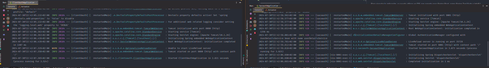
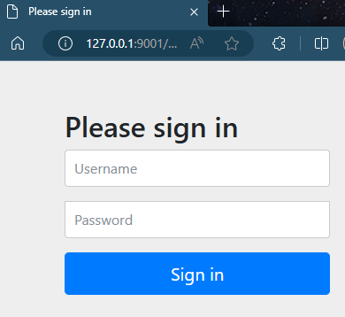
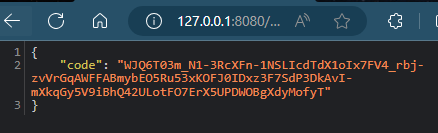
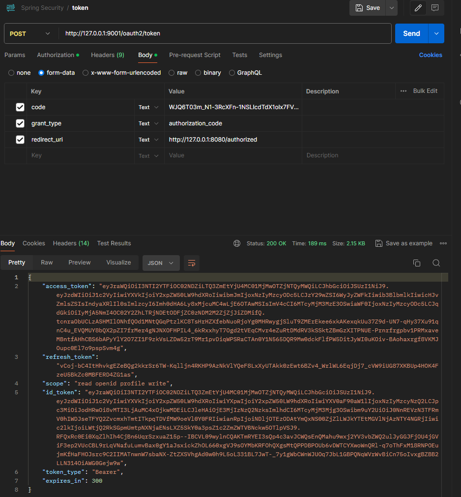
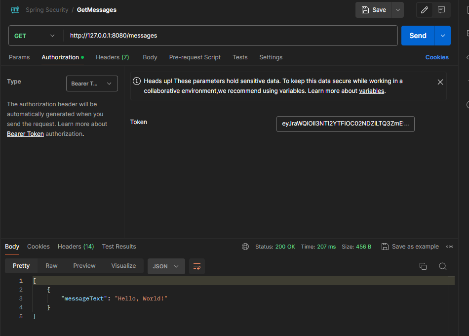
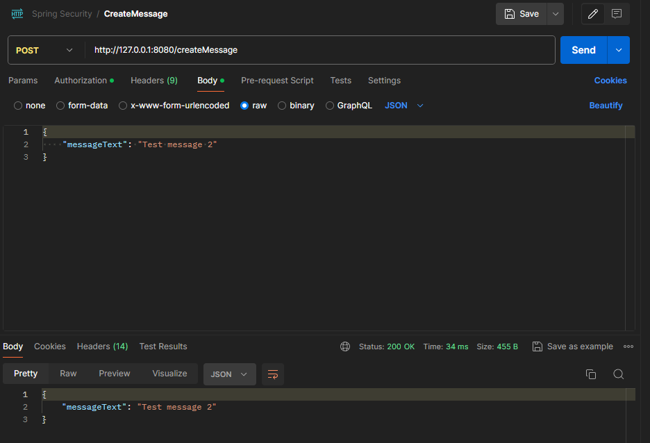

# Aprendiendo a usar OAuth2 con Spring Security

Este proyecto alojado en [sacooauth-client](https://github.com/CurtoBrull/clientOauth) funciona junto a un servidor de autorización OAuth2 que se encuentra en el repositorio [SACOauth](https://github.com/CurtoBrull/SACOauth)

## 1. Crear un proyecto Spring Boot

Para crear un proyecto Spring Boot, se puede utilizar [Spring Initializr](https://start.spring.io/) o un IDE con soporte para Spring Boot, como [Spring Tool Suite](https://spring.io/tools) o [IntelliJ IDEA](https://www.jetbrains.com/idea/).

En este caso, se creó un proyecto con las siguientes características:

- Project: Maven Project
- Language: Java
- Spring Boot Version: 3.3.2
- Project Metadata:
  - Group: eu.jcurto
  - Artifact: clientOauth
  - Name: clientOauth
  - Description: clientOauth
  - Package Name: eu.jcurto.clientoauth
- Dependencies:
    - Spring Web
    - Spring Security
    - Spring Boot DevTools
    - OAuth2 Client
    - OAuth2 Resource Server
    - Lombok
    - Spring Boot Starter Test
    - Spring Security Test
- Java Version: 21
- Packaging: Jar

## 2. Application.yml

El archivo `application.yml` contiene la configuración de la aplicación Spring Boot relacionada con la seguridad y la autenticación OAuth2. 

A continuación, se explica cada sección del archivo:

### Configuración de Spring Security y OAuth2

La configuración de `spring.security.oauth2` se utiliza para definir cómo la aplicación manejará la autenticación y autorización utilizando OAuth2.

```yaml
spring:
  security:
    oauth2:
```

#### Configuración del servidor de recursos

Dentro de `resourceserver`, se especifica la configuración del servidor de recursos JWT (JSON Web Token). El `issuer-uri` es la URL del emisor de los tokens JWT.

```yaml
resourceserver:
  jwt:
    issuer-uri: "http://127.0.0.1:9001"
```

#### Configuración del cliente OAuth2

La sección `client` contiene la configuración del cliente OAuth2. Aquí se definen los detalles de registro del cliente y del proveedor.

```yaml
client:
  registration:
    client-oauth:
      provider: spring
      client-id: client-oauth
      client-secret: secret
      authorization-grant-type: authorization_code
      redirect-uri: "http://127.0.0.1:8080/authorized"
      scope:
        - openid
        - profile
        - read
        - write
      client-name: client-oauth
```

- `provider`: Define el proveedor de OAuth2, en este caso, `spring`.
- `client-id` y `client-secret`: Identificadores del cliente.
- `authorization-grant-type`: Tipo de concesión de autorización, aquí es `authorization_code`.
- `redirect-uri`: URI de redirección después de la autenticación.
- `scope`: Alcances solicitados por el cliente.
- `client-name`: Nombre del cliente.

#### Configuración del proveedor OAuth2

La sección `provider` define la configuración del proveedor de OAuth2, incluyendo el `issuer-uri`.

```yaml
provider:
  spring:
    issuer-uri: "http://127.0.0.1:9001"
```

`application.yml` configura la seguridad de la aplicación utilizando OAuth2, especificando tanto la configuración del servidor de recursos JWT como la del cliente y proveedor OAuth2.

## 3. SecurityConfig.java

La clase `SecurityConfig` en el paquete `eu.jcurto.clientoauth.oauth` configura la seguridad de la aplicación utilizando Spring Security. Esta clase está anotada con `@Configuration`, lo que indica que es una clase de configuración de Spring.

```java
@Configuration
public class SecurityConfig {
```

Dentro de esta clase, se define un método `securityFilterChain` anotado con `@Bean`, lo que indica que este método produce un bean que será administrado por el contenedor de Spring. Este método configura la cadena de filtros de seguridad (`SecurityFilterChain`) para la aplicación.

```java
@Bean
SecurityFilterChain securityFilterChain(HttpSecurity httpSecurity) throws Exception {
```

`securityFilterChain` utiliza el objeto `HttpSecurity` para configurar varias políticas de seguridad. Primero, se configuran las autorizaciones de las solicitudes HTTP. Por ejemplo, se permite el acceso a la ruta `/authorized` a todos los usuarios, mientras que otras rutas requieren diferentes niveles de autoridad.

```java
httpSecurity.authorizeHttpRequests(authHttp -> authHttp
    .requestMatchers(HttpMethod.GET, "/authorized").permitAll()
    .requestMatchers(HttpMethod.GET, "/messages").hasAnyAuthority("SCOPE_read", "SCOPE_write")
    .requestMatchers(HttpMethod.POST, "/createMessage").hasAuthority("SCOPE_write")
    .anyRequest().authenticated()
)
```

Se deshabilita la protección CSRF (Cross-Site Request Forgery) con `csrf(csrf -> csrf.disable())`.

```java
.csrf(csrf -> csrf.disable())
```

La gestión de sesiones se configura para que la política de creación de sesiones sea `STATELESS`, lo que significa que no se mantendrán sesiones en el servidor.

```java
.sessionManagement(session -> session.sessionCreationPolicy(SessionCreationPolicy.STATELESS))
```

Se configura la autenticación OAuth2 para que utilice una página de inicio de sesión personalizada.

```java
.oauth2Login(login -> login.loginPage("/oauth2/authorization/client-oauth"))
```

Se configura el cliente OAuth2 y el servidor de recursos OAuth2 para que utilicen JWT (JSON Web Tokens) con configuraciones predeterminadas.

```java
.oauth2Client(withDefaults())
.oauth2ResourceServer(resourceServer -> resourceServer.jwt(withDefaults()))
```

El método `securityFilterChain` retorna la configuración de seguridad construida.

```java
return httpSecurity.build();
```

## 4. Modelo de datos

La clase `Message` en el paquete `eu.jcurto.clientoauth.models` es un modelo de datos simple que representa un mensaje en la aplicación. Esta clase utiliza las anotaciones de Lombok para reducir el código boilerplate, como getters, setters, constructores y métodos `toString`.

```java
@Data
@NoArgsConstructor
@AllArgsConstructor
public class Message {
```

La anotación `@Data` de Lombok genera automáticamente los métodos `getter` y `setter` para todos los campos, así como los métodos `equals`, `hashCode` y `toString`. La anotación `@NoArgsConstructor` genera un constructor sin argumentos, y la anotación `@AllArgsConstructor` genera un constructor con un argumento para cada campo de la clase.

```java
private String messageText;
```

La clase `Message` tiene un solo campo, `messageText`, que es una cadena de texto que contiene el contenido del mensaje. Este campo se utiliza en los controladores de la aplicación para crear y mostrar mensajes.

En resumen, la clase `Message` es un modelo de datos muy simple para representar mensajes en la aplicación.

## 5. Controladores

La clase `AppController` en el paquete `eu.jcurto.clientoauth.controllers` es un controlador REST que maneja las solicitudes HTTP para la aplicación. Esta clase está anotada con `@RestController`, lo que indica que es un controlador donde cada método devuelve un objeto de dominio en lugar de una vista.

```java
@RestController
public class AppController {
```

`AppController` define tres endpoints: uno para obtener una lista de mensajes, otro para crear un nuevo mensaje y uno más para manejar la autorización, devolviendo el código recibido como parámetro.

### 5.1. Método `messageList`

El método `messageList` maneja las solicitudes GET a la ruta `/messages`. Este método devuelve una lista de objetos `Message`. Para este ejemplo se devuelve una lista con un solo mensaje que contiene el texto "Hello, World!".

```java
@GetMapping("/messages")
public List<Message> messageList() {
    return Collections.singletonList(new Message("Hello, World!"));
}
```

### 5.2. Método `createMessage`

El método `createMessage` maneja las solicitudes POST a la ruta `/createMessage`. Este método recibe un objeto `Message` en el cuerpo de la solicitud y lo devuelve después de imprimir su contenido en la consola.

```java
@PostMapping("/createMessage")
public Message createMessage(@RequestBody Message message) {
    System.out.println("Message created: " + message.getMessageText());
    return message;
}
```

### 5.3. Método `authorized`

El método `authorized` maneja las solicitudes GET a la ruta `/authorized`. Este método recibe un parámetro de consulta `code` y devuelve un mapa con el código recibido.

```java
@GetMapping("/authorized")
public Map<String, String> authorized(@RequestParam String code) {
    return Collections.singletonMap("code", code);
}
```

## 6. Funcionamiento de la aplicación junto al servidor de autorización

Primero necesitamos iniciar el servidor de autorización OAuth2, que se encuentra en el repositorio [SACOauth](

Una vez iniciado el servidor de autorización, podemos iniciar la aplicación cliente.



Al acceder a la ruta `http://127.0.0.1:8080/oauth2/authorization/client-oauth`, la aplicación redirigirá al servidor de autorización para autenticar al usuario.



Nos autenticamos con las credenciales `user` y `password` y damos permiso a la aplicación cliente para conseguir el code que usaremos en postman.



Abrimos postman y hacemos una petición POST a la ruta `http://127.0.0.1:9001/oauth2/token` con los siguientes parámetros:

- code: el código que hemos obtenido anteriormente
- grant_type: authorization_code
- redirect_uri: http://127.0.0.1:8080/authorized



Copiamos el access_token que nos devuelve el servidor de autorización y hacemos una petición GET a la ruta `http://127.0.0.1:8080/messages` con el access_token como Bearer token en Authorization.

Si todo ha ido bien, obtendremos el mensaje "Hello, World!".



Igualmente para la ruta POST `http://127.0.0.1:8080/createMessage` con el access_token como Bearer token en Authorization y un body con el mensaje que queremos crear.
Si todo ha ido bien, obtendremos el mensaje creado.



## 7. Conclusión

En este proyecto, hemos aprendido a usar OAuth2 con Spring Security para autenticar y autorizar a los usuarios en una aplicación Spring Boot. Hemos configurado la aplicación cliente para interactuar con un servidor de autorización OAuth2 y hemos implementado un controlador REST para manejar las solicitudes HTTP. Además, hemos utilizado JWT (JSON Web Tokens) para asegurar la comunicación entre el cliente y el servidor.
